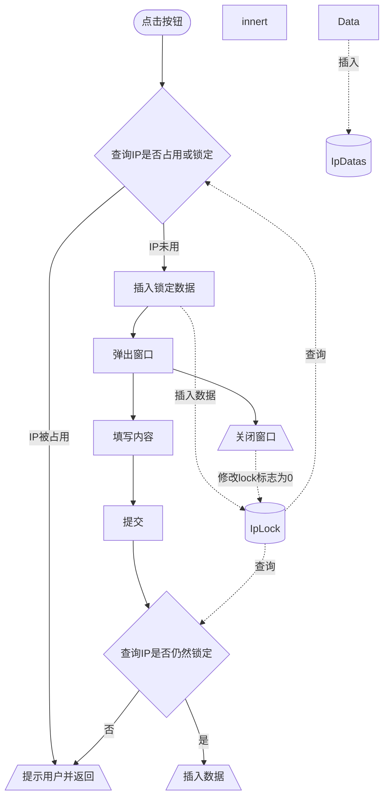
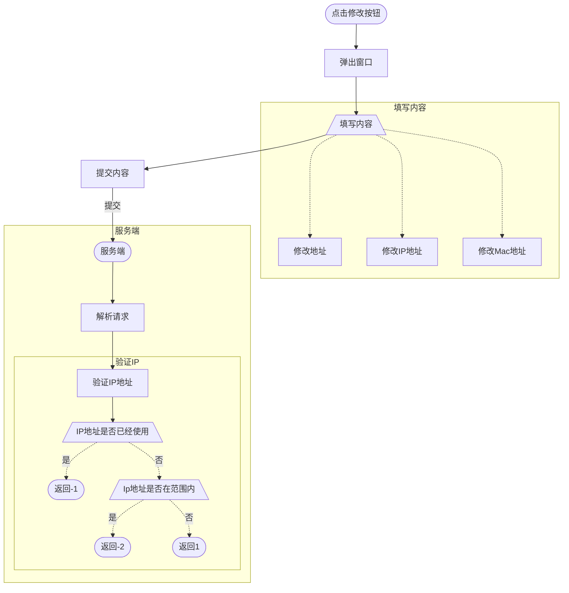
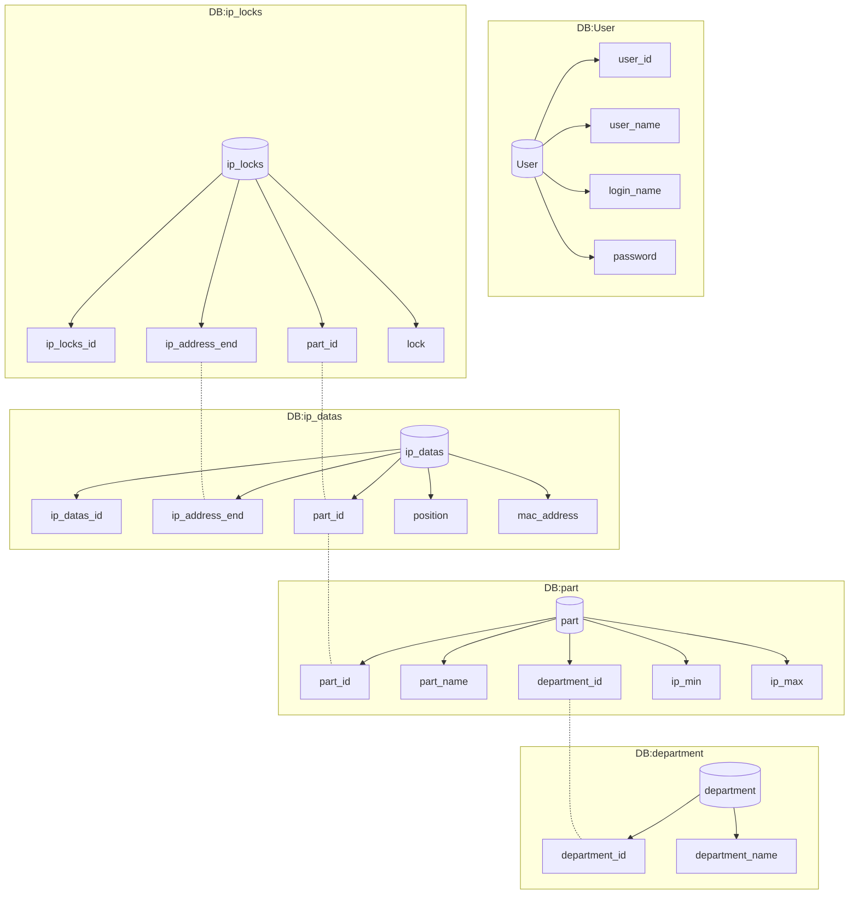

<!--
 * @Descripttion: 使用ctrl+alt+i添加头部注释，ctrl+alt+t添加方法注释, 或者复制方法名后使用gocm来添加方法注释
 * @version: 
 * @Author: bb
 * @Date: 2020-12-29 13:46:16
 * @LastEditors: bb
 * @LastEditTime: 2020-12-29 15:36:16
-->
语法 https://mermaid-js.github.io/mermaid
## 锁定ip

## 修改ip数据

## 数据库关系
